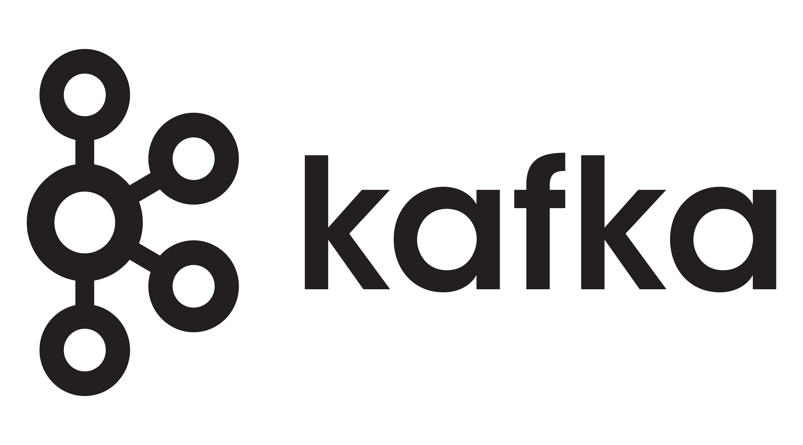

# Basic Apache Kafka Consumer

Kafka consumer that can utilize a schema registry. Please ensure the correct broker, schema registry connection 
details are configured properly in the ``src/main/resources/application.yaml``

## Deploy in Kubernetes

You can use the [deployments.yaml](src/main/resources/application.yaml) to create up and running 
kafka consumers inside a kubernetes cluster.

You have to also configure the below env inside the [deployments.yaml](src/main/resources/application.yaml) file.

### Container ENV variables
| _ENV name_ | _Description_ |
| --- | --- |
| `TOPIC` | targetted topic to be pointed to |
| `GROUP_ID` | Group Id for kafka consumers |
